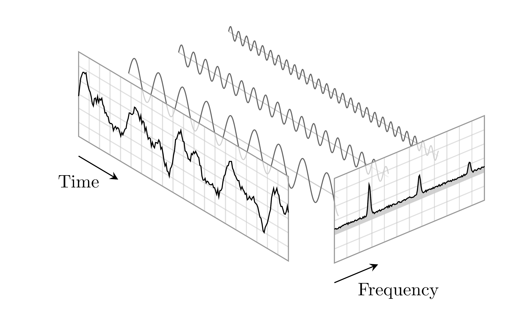

# Lecture Notes of Digital Signal Processing
Lectures notes of the Master degree course "Digital Signal Processing", held by professor Federica Battisti at the University of Padua (Academic Year 2020/2021).

    

## Organization of the repository
The repository is organized as follow:
* **`main`**: it contains the main document with the notes of every lesson;
* **`lessons`**: inside it there are separate folders for each theory lesson. Inside them, there is the following structure:
    * `XX.tex`: source code of the `XX` lesson;
    * `XX.pdf`: pdf of the `XX` lesson, obtained from compiling the `XX.tex` file with pdflatex;
    * `XX_images`: every image of the `XX` lesson, mainly taken from professor's slides;
* **`macro`**: inside it there are useful files for latex packages, new commands and several settings. These are imported in the main document;
* **`frontespizio`**: it contains latex files and images for the titlepage of the main document;
* **`bibliography`**: it contains the latex file for bib items (for citations);
* **`exercise`**: this folder is still empty, but the idea is that it will provide the content of the exercise lessons done with MatLab.

## Topics of the course
The topics treated during the course are:
* introduction and motivations of the field of Digital Signal Processing;
* discrete-time signals;
* discrete-time systems;
* Fourier analysis, with particular attention to the discete Fourier transform;
* z-transform;
* concepts and techniques for filter design.
